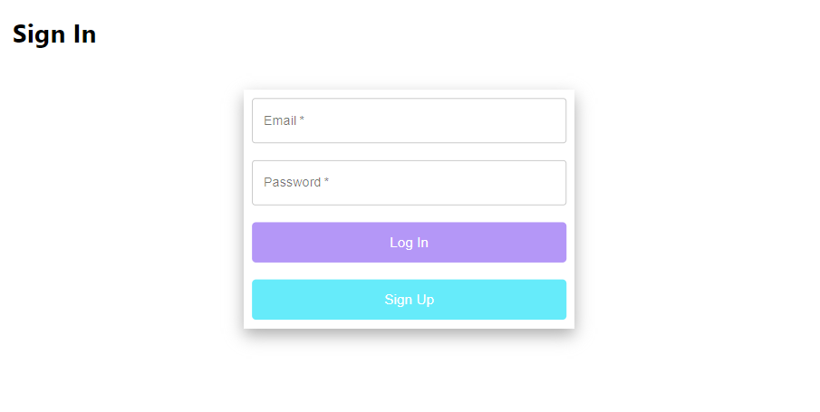
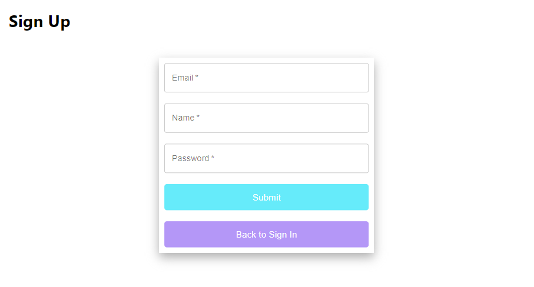
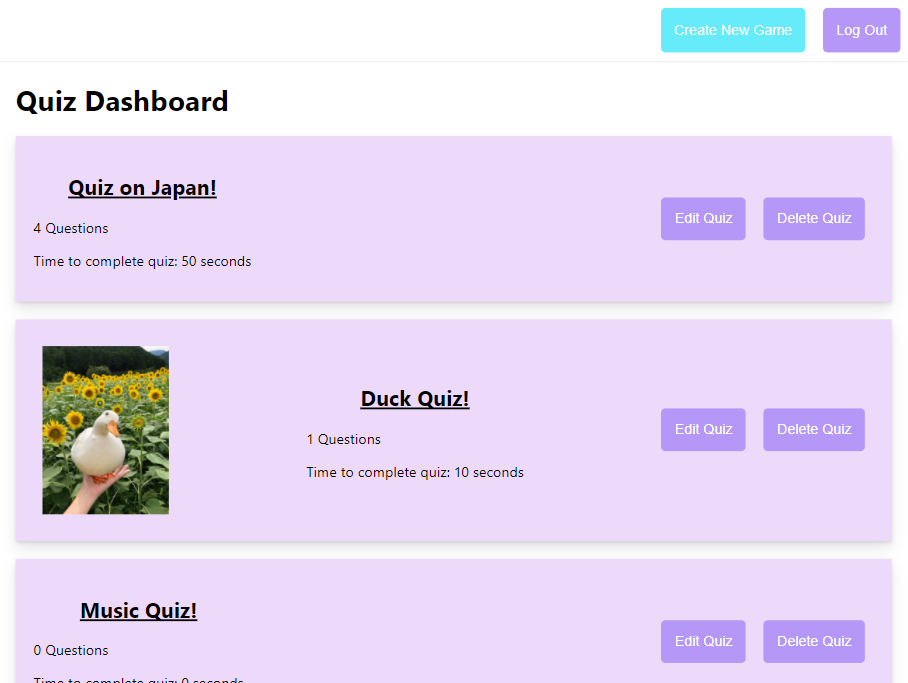
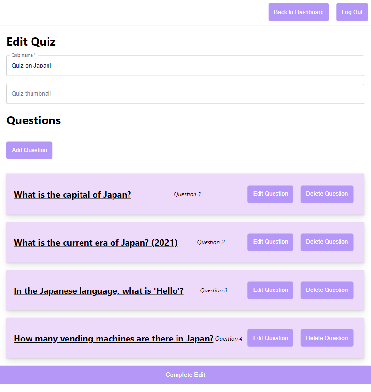
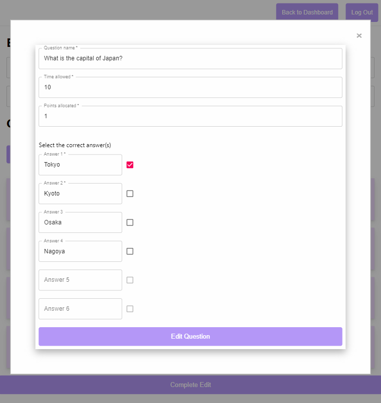

# ReactJS-BigBrain
A responsive website made in ReactJS.  
Similar concept to a popular quiz website named Kahoot.

## Instructions
1. Clone the repository
2. To run the backend server, go into the backend directory and run `npm run backend`
3. To run the frontend server, go into the frontend directory and run `yarn start`

## Features of the website
- Sign in as a registered user using username and password
- Sign up as a new user with email, name and password
- View the dashboard full of quizzes that's made by you 
- Create new quizzes
- Log out any time you want
- Edit or delete quizzes to your own likings
- While editing a quiz you can:
  - Edit the quiz name
  - Edit the quiz thumbnail
  - Add as many questions as you wish
  - Edit or delete questions
- While editing a question you can:
  - Edit the question name
  - Edit the time allowed for this question
  - Edit the points allocated for this question
  - Add in anywhere from 2 - 6 answers
  - Select the correct answer(s)

## Gallery
### Sign In Page

### Sign Up Page

### Dashboard

### Edit Quiz Page

### Edit Questions Page

